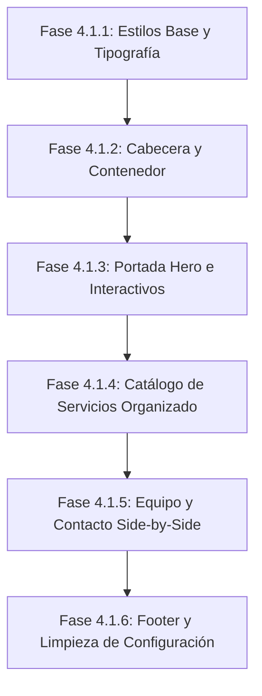

# Plan de Rediseño Visual Genérico (Fase 4.1)

Este plan detalla el paso a paso de la reestructuración y diseño visual de la **Plantilla Universal de Reservas**, tomando como referencia estética directa la imagen adjunta por el usuario (diseño premium, fondos claros, acentos degradados, bordes redondeados amplios, sombras de profundidad suaves, tipografía moderna y tarjetas glassmorphic flotantes).

El trabajo se dividirá en subfases incrementales y autocontenidas para verificar el diseño sección por sección antes de continuar.

---

## Estructura de Subfases y Tareas

---

### Fase 4.1.1: Estilos Base, Tipografía y Variables CSS Dinámicas
*   **Tipografía Premium:**
    *   Importar las fuentes de Google Fonts `Plus Jakarta Sans` (para títulos H1, H2, H3) e `Inter` (para textos de lectura y botones).
*   **Alineación de Variables en `global.css`:**
    *   Redefinir variables CSS en `:root` para lograr una estética clara, limpia y de alto contraste:
        *   `--bg`: `#fcfbf9` (fondo crema/blanco ultra suave).
        *   `--surface`: `#ffffff` (blanco puro para tarjetas).
        *   `--text`: `#0f172a` (gris oscuro/slate para máxima legibilidad).
        *   `--primary`: Color corporativo del negocio en hexadecimal.
    *   **Cálculo de variantes dinámicas con `color-mix()`:**
        *   `--primary-hover`: Oscurecido al 15% (`color-mix(in srgb, var(--primary) 85%, black)`).
        *   `--primary-light`: Fondo traslúcido al 10% (`color-mix(in srgb, var(--primary) 10%, transparent)`).
        *   `--primary-border`: Bordes suaves al 20% (`color-mix(in srgb, var(--primary) 20%, transparent)`).
        *   `--shadow-color`: Sombra sutil tiñéndose ligeramente del color primario.

---

### Fase 4.1.2: Cabecera y Contenedor Base (`PublicLayout.tsx`)
*   **Barra de Navegación (Header):**
    *   Diseño flotante con fondo traslúcido (`backdrop-filter: blur(12px)`) y borde inferior muy fino en `--primary-border`.
    *   Logo: Iniciales del negocio en círculo con color de marca o logo en texto limpio.
    *   Enlaces superiores: `Inicio` | `Servicios` | `Equipo` | `Contacto` con transiciones suaves en hover.
    *   Botón CTA "Agendar": Bordes redondeados y animación de elevación interactiva.

---

### Fase 4.1.3: Portada Hero e Interactivos (`HomePage.tsx`)
*   **Layout Asimétrico (Estilo Referencia):**
    *   *Columna Izquierda (Copywriting):*
        *   Badge superior indicando estado activo.
        *   Título H1 gigante: Primera parte en tono neutro, segunda parte destacada utilizando la variable `--primary` de forma dinámica.
        *   Botón principal con diseño redondeado y sombra difuminada.
    *   *Columna Derecha (Fondo y Tarjeta Flotante):*
        *   **Blob de Fondo:** Un círculo con gradiente difuminado que se tiñe suavemente del color corporativo.
        *   **Glassmorphic Booking Card:** Tarjeta interactiva flotante con borde blanco semi-traslúcido, sombra de gran radio de difusión y efecto de desenfoque (`backdrop-filter`), que muestra información de reserva rápida del negocio actual.

---

### Fase 4.1.4: Catálogo de Servicios Simple y Organizado
*   **Grid de Servicios (Cards):**
    *   Tarjetas con `border-radius: 16px` o `24px` y borde suave.
    *   Efecto hover: Desplazamiento vertical hacia arriba (lift) y aumento de la intensidad de la sombra.
*   **Organización:**
    *   Los servicios se listan en el grid ordenados. Para separarlos de manera limpia, se inyectarán encabezados con el nombre de la categoría (ej: *"Estética Facial"* o *"Manicuría"*) como separadores de sección de texto plano elegantes.
*   **Acentos de Tarjeta:**
    *   Badge de duración con fondo `--primary-light` y texto del color `--primary`.
    *   Precio destacado en el extremo inferior.

---

### Fase 4.1.5: Equipo y Contacto Side-by-Side
*   **Sección Nuestro Equipo:**
    *   Diseño inspirado en el pie del Hero de la imagen de referencia (tarjetas minimalistas individuales para cada profesional).
    *   Avatar circular con las iniciales y fondo pastel dinámico.
    *   Enlace rápido "Reservar con [Nombre]" que abre el Asistente pre-seleccionándolo.
*   **Sección Contacto e Horarios:**
    *   *Izquierda:* Tabla minimalista que detalla la agenda de atención semanal del local.
    *   *Derecha:* Tarjeta de contacto directa por WhatsApp con el número del negocio.

---

### Fase 4.1.6: Footer y Consolidación de Configuración
*   **Powered by TurnoFácil:**
    *   Pie de página con enlaces y el badge discreto SaaS si `showBranding` es verdadero.
*   **Remoción de Controles no Deseados:**
    *   **[MODIFY] [AdminSettingsPage.tsx](file:///c:/Users/vale-/CodeProjects/Freelance/TurnoFacil/frontend/src/features/admin/pages/AdminSettingsPage.tsx):** Eliminar el checkbox "Mostrar branding de TurnoFácil" del panel de configuración de la empresa para asegurar que el inquilino no pueda desactivarlo por su cuenta.
    *   **[MODIFY] [BusinessController.java](file:///c:/Users/vale-/CodeProjects/Freelance/TurnoFacil/backend/Appointment-Manager-API/src/main/java/com/turnos/api/business/BusinessController.java):** Modificar el método de actualización para ignorar o no recibir el parámetro `showBranding` desde el payload del administrador, haciéndolo exclusivamente modificable por el SuperAdmin.
