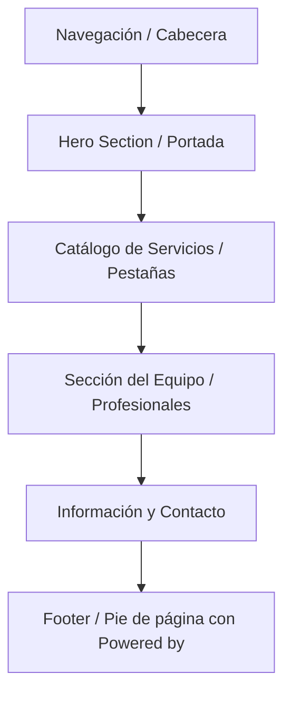

# Propuesta de Diseño Genérico Paramétrico (Fase 4)

Este documento define la estructura visual, secciones y componentes (artefactos) de la **Plantilla Universal de Reservas** que utilizarán todos los negocios del SaaS. 

El objetivo es lograr un diseño **premium, moderno y minimalista** que se adapte automáticamente al rubro del negocio (estética, barbería, consultorio, etc.) a partir de sus datos y su paleta de colores.

---

## 1. Paleta de Colores y Estética Dinámica

Para que el diseño se adapte sin romper la legibilidad, usaremos variables CSS inyectadas dinámicamente desde el `BusinessProvider`:

*   `--primary-color`: El color identitario del negocio (ej. `#ff007f` para estética, `#1e3a8a` para una clínica, `#d97706` para una barbería).
*   `--primary-color-hover`: Una versión ligeramente más oscura para interactividad.
*   `--primary-color-10`: El color principal con un 10% de opacidad para fondos sutiles, badges y estados activos.
*   **Fondo y Tipografía Neutros:** Se mantendrá un fondo limpio (modo claro/oscuro minimalista) y tipografías neutras premium (`Inter` o `Outfit`) para garantizar legibilidad óptima en cualquier combinación.

---

## 2. Estructura de la Web Pública del Negocio (`/n/:businessSlug`)

La página se compone de 5 secciones modulares diseñadas para verse fluidas y premium en móviles y computadoras:



---

### A. Cabecera (Header Layout)
*   **Logotipo/Nombre:** 
    *   Si el negocio tiene logo: Se renderiza el logotipo optimizado.
    *   Si no tiene logo: Se muestran las iniciales del negocio con un círculo de color corporativo de fondo, junto al nombre del negocio en texto limpio.
*   **Enlaces de Navegación:** `Inicio` | `Servicios` | `Nuestro Equipo` | `Contacto`
*   **Botón Agendar (CTA Principal):** Un botón flotante destacado que usa el color principal del negocio y destaca con una sutil animación de pulso. Al presionarlo, abre directamente el Asistente de Reserva.

---

### B. Portada del Negocio (Hero Section)
Para no depender de fotos específicas de un solo rubro, usaremos una composición asimétrica moderna:

*   **Columna Izquierda (Información y Eslogan):**
    *   *Kicker (Pequeña etiqueta superior):* Un badge con el color corporativo que dice *"Turnos Online"* o *"Agenda Abierta"*.
    *   *Título (H1):* El nombre del negocio (`business.name`) seguido de un texto de bienvenida paramétrico (ej: *"Reservá tu espacio con nuestros profesionales"*).
    *   *Descripción:* Un párrafo breve sobre el negocio (leído de la base de datos).
    *   *Acciones:* Botón principal *"Reservar Turno"* y botón secundario *"Ver Servicios"*.
*   **Columna Derecha (Tarjeta de Reservas Rápidas):**
    *   Una tarjeta con efecto de vidrio esmerilado (Glassmorphic) que flota sobre un fondo con degradados de color dinámicos. 
    *   Esta tarjeta invita a la acción inmediata con selectores rápidos del servicio y profesional favoritos.

---

### C. Catálogo de Servicios (Tabs & Grid)
Esta sección carga de forma dinámica el catálogo del backend y elimina los tratamientos fijos:

*   **Pestañas de Categorías (Tabs Bar):** 
    Una barra horizontal con scroll lateral en móviles donde cada pestaña es una categoría del negocio (ej: *Cabello*, *Barba*, *Tratamientos*).
*   **Cuadrícula de Servicios (Grid):**
    Al hacer clic en una categoría, se despliega una lista de tarjetas de servicios con:
    *   Nombre del servicio.
    *   Duración (ej. `30 min`) y precio en formato destacado (ej. `$12.000`).
    *   Descripción detallada.
    *   Botón *"Agendar"* individual.

---

### D. Nuestro Equipo (Staff Section)
Muestra a los profesionales activos que atienden al público:

*   **Tarjetas de Profesionales (Cards):**
    *   **Avatar Circular:** Un círculo con la inicial del profesional en contraste premium con el color corporativo del negocio (o su foto si está cargada).
    *   **Nombre Completo.**
    *   **Especialidad / Rol** (ej: *"Esteticista"*, *"Estilista Senior"*).
    *   **Botón de Reserva Directa:** *"Agendar con [Nombre]"*.

---

### E. Información y Contacto
*   **Horarios del Negocio:** Una tabla minimalista que muestra los rangos de atención configurados para el negocio.
*   **Contacto Directo:**
    *   Dirección física del local.
    *   Botón de WhatsApp dinámico que redirige a `https://wa.me/{telefono_negocio}` con el número cargado en la configuración.

---

### F. Pie de Página (Footer & SaaS Branding)
*   **Derechos de Marca:** Nombre del negocio y enlaces legales.
*   **Marca del SaaS (`show_branding`):**
    *   *Plan Free:* Se muestra un banner discreto en la parte inferior que dice:
        > ⚡ *Powered by **TurnoFácil** - Creá la agenda online de tu negocio gratis.* (Enlace al registro de SaaS).
    *   *Plan Pro:* El banner desaparece por completo, logrando una estética 100% marca blanca para el cliente.

---

## 3. Flujo Visual del Asistente de Reserva (Booking Wizard)

Al presionar cualquier botón de "Agendar", la pantalla se oscurece y se despliega un asistente de reservas minimalista tipo pantalla completa, dividido en 4 pasos claros:

```
[ Paso 1: Servicio ]  ➔  [ Paso 2: Profesional ]  ➔  [ Paso 3: Fecha y Hora ]  ➔  [ Paso 4: Confirmación ]
```

1.  **Paso 1 (Servicio):** Lista vertical simple de servicios para elegir uno.
2.  **Paso 2 (Profesional):** Muestra el staff compatible con el servicio seleccionado (o la opción *"Cualquier Profesional"*).
3.  **Paso 3 (Fecha y Hora):** Un calendario interactivo limpio donde seleccionas el día, mostrando a la derecha los horarios libres del profesional en celdas clicables.
4.  **Paso 4 (Confirmación/Guest checkout):**
    *   *Si está autenticado:* Muestra los detalles del turno y el botón "Confirmar".
    *   *Si es invitado (público):* Muestra un formulario minimalista para rellenar: *Nombre*, *Email* y *Teléfono (opcional)* antes de enviar el turno.

---

## 4. Próximos Cambios en Base de Datos para Habilitar esto

Para alimentar esta plantilla paramétrica con datos reales en el backend, en la **Fase 4** sumaremos estas columnas a la tabla `business` en una pequeña migración:

1.  `description` (VARCHAR 255): Descripción breve de presentación del negocio.
2.  `logo_url` (VARCHAR 255 - Opcional): Para cuando se habiliten las imágenes.
3.  `address` (VARCHAR 255 - Opcional): Dirección física del local.
